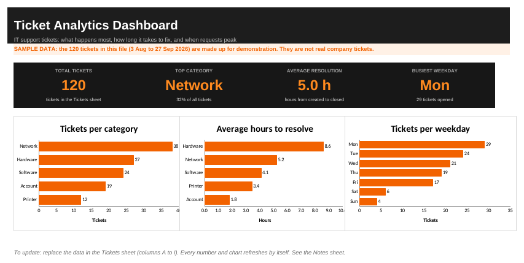

# [Project Title]
> One-line description. Example: A web-based help desk where users submit IT tickets and technicians track and resolve them, with AI-assisted ticket classification.

**Live demo:** [link] | **Documentation (PDF):** [link] | **Status:** [In progress / Completed]

## 1. Project Overview
What the system does in 3 to 4 sentences. Who uses it, and what it replaces.

## 2. Problem Statement
Describe the real problem. Example: "IT requests are sent by chat and paper, so tickets get lost, nobody knows their status, and repeated problems are never counted."

## 3. Objectives
- General objective:
- Specific objectives (3 to 5, measurable):
  1.
  2.
  3.

## 4. Target Users
| User | What they do in the system |
|---|---|
| Employee / Requester | Submits and tracks tickets |
| IT Technician | Assigns, updates and closes tickets |
| Administrator | Manages users and categories |

## 5. Technologies Used
| Layer | Technology |
|---|---|
| Front end | HTML, CSS, JavaScript, Bootstrap |
| Back end | [PHP / Python Flask / Node.js] |
| Database | [MySQL] |
| Tools | Git, GitHub, [VS Code, XAMPP, Postman] |
| AI feature | [API or rule-based method used] |

## 6. System Features
- [ ] User interface
- [ ] Authentication (login, logout, roles)
- [ ] CRUD for tickets
- [ ] Input validation
- [ ] Search and filter
- [ ] Error handling
- [ ] AI-assisted ticket classification
(Tick what is really finished.)

## 7. System Architecture

Explain the flow in 3 to 5 lines: browser -> web server -> database -> AI classifier.

## 8. Database Design

List each table with its purpose and main fields.

## 9. Screenshots
| Login | Dashboard | Ticket list |
|---|---|---|
|  |  |  |

## 10. Installation
```bash
git clone https://github.com/[username]/[repo-name].git
cd [repo-name]
# 1. Create the database and import the SQL file
mysql -u [user] -p [database_name] < database/schema.sql
# 2. Copy the settings file and fill in your own values
cp .env.example .env
# 3. Start the app
[php -S localhost:8000   OR   flask run]
```
Open http://localhost:[port]. Default test login: [username / password for TESTING ONLY].

## 11. How to Use
1. Log in.
2. Create a ticket.
3. (Technician) assign and update the ticket status.
4. Search tickets by keyword or status.

## 12. Testing
Summary: [x] of [y] test cases passed. See `TEST_CASES.md`. Tools used: [manual testing, browser, Postman].

## 13. Limitations
- [Example: no email notifications]
- [Example: AI classification is wrong on unusual tickets]

## 14. Future Improvements
- [Example: email alerts, mobile layout, reports dashboard]

## 15. Security Notes
Passwords are hashed. Queries use prepared statements. Secrets are kept in `.env` and never committed.

## 16. Developer
**Edward S. Vidal**, BSIT, Datamex College of Saint Adeline
GitHub: https://github.com/Warden64595 | LinkedIn: https://www.linkedin.com/in/edward-vidal-5536613a5 | Email: edwardsajovidal@gmail.com
